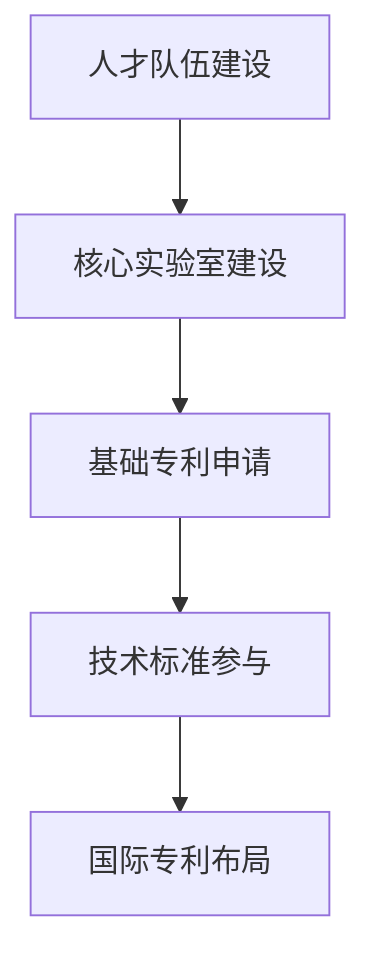
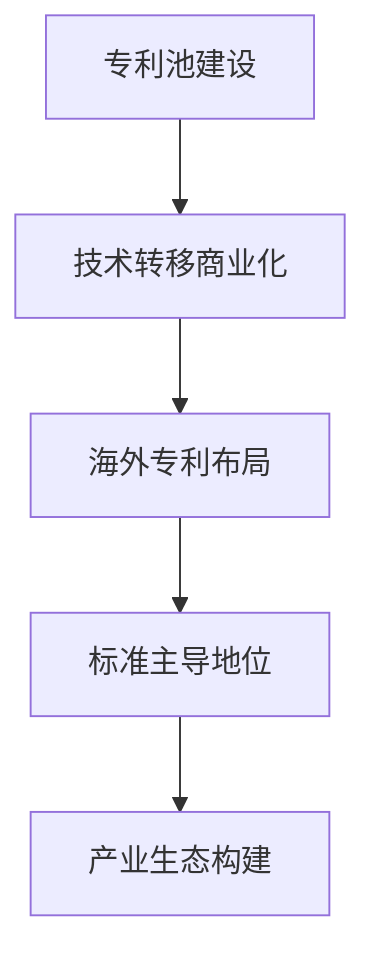
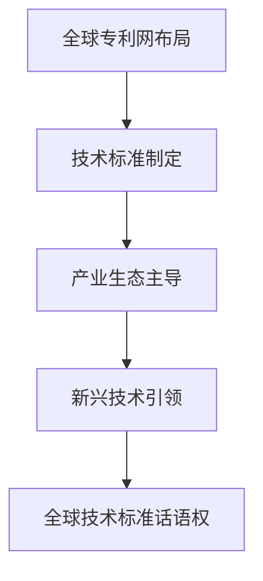

# 空天专利战略及重点专利布局策略

## 报告概览

**战略主题**: Aerospace Patent Strategic Planning and Key Patent Layout Strategy  
**战略目标**: 建立空天领域技术垄断地位，实现专利价值最大化  
**执行周期**: 2026-2035年 (十年战略规划)  
**核心战场**: 卫星通信、量子导航、北斗增强、新材料应用技术  

---

## 📊 战略环境分析

### 全球空天专利竞争格局

#### **美国空天专利战略概览**
- **专利总量**: 持有全球约35%的核心空天专利
- **技术导向**: 卫星通信、量子传感、深空探测技术
- **战略目标**: 维持技术领先与供应链控制
- **薄弱环节**: 成本敏感的星座规模化部署技术

#### **欧洲空天专利战略特点**
- **专利总量**: 占据约25%的市场份额
- **技术焦点**: 伽利略卫星导航系统、欧洲太空局技术
- **战略优势**: 系统集成与产业链协同能力强
- **竞争劣势**: 核心元器件和技术自主性不足

#### **中国空天专利战略机遇**
- **专利总量**: 已突破全球20%，位列第二
- **技术潜力**: 卫星星座、大批量制造、AI智能控制等领域领跑
- **战略机遇**: 弯道超车窗口期，专利基础快速累积
- **战略短板**: 高端芯片、光电元器件等关键技术受制于人

### 关键技术领域专利分布分析

```
技术领域       | 中国专利比重 | 全球市场份额 | 技术成熟度 | 战略价值
----------------|--------------|--------------|------------|----------
卫星星座通信    | 35%         | 15%         | 高         | ⭐⭐⭐⭐⭐
量子导航传感    | 12%         |  8%         | 中         | ⭐⭐⭐⭐⭐
微纳卫星技术    | 42%         | 18%         | 高         | ⭐⭐⭐⭐⭐
太空材料科学    | 28%         | 12%         | 中         | ⭐⭐⭐⭐⭐
AI自主控制     | 55%         | 25%         | 低->中     | ⭐⭐⭐⭐⭐
电磁推进技术    | 18%         | 10%         | 低         | ⭐⭐⭐⭐⭐
```

---

## 🎯 核心战略目标体系

### **战略愿景 (2035目标)**
- **专利总量**: 突破空天领域全球专利总量的35%
- **核心技术**: 在5大战略技术领域建成专利护城河
- **技术领先**: 实现"卡脖子"技术专利自主可控
- **产业地位**: 成为全球空天专利战略制高点

### **战略阶段规划**
```
阶段     | 时间       | 专利总量目标 | 核心任务
----------|------------|--------------|----------
起步期   | 2026-2028 | 2000+项     | 基础专利积累，关键技术突破
快速发展 | 2029-2031 | 5000+项     | 规模化专利布局，技术标准制定
战略引领 | 2032-2035 | 10000+项    | 专利生态构建，全球领先地位确立
```

---

## 🔬 重点技术领域专利布局策略

### **战略一: 卫星星座通信技术**

#### **技术现状评估**
- **全球专利**: 约12000项，美国主导60%
- **中国地位**: 已突破35%市场份额，快速追赶
- **技术空白**: 低轨星座频谱优化、大规模网络管理

#### **专利布局重点**
**🎯 第一梯队 (2026-2028)**
- **低轨星座网络架构专利**: 星间激光通信、动态路由协议
- **智能频谱管理**: 频谱感知、干扰抑制、抗干扰通信
- **边缘计算专利**: 卫星边缘AI、智能数据处理

**🎯 第二梯队 (2029-2031)**
- **星座安全技术**: 量子密钥分发、抗量子攻击
- **AI优化调度**: 基于ML的网络资源分配、故障预测
- **卫星间协同**: 多星协同观测、数据融合算法

**🎯 第三梯队 (2032-2035)**
- **下一代通信**: 太赫兹通信、自由空间光学通信
- **卫星互联网**: Web3.0太空基础设施、分布式网络
- **跨星座协同**: 国际星座互操作、技术标准的制定

#### **核心专利挖掘策略**
1. **基础专利**: 通信协议、编解码技术、波束形成算法
2. **应用专利**: 星座特有技术、商业运营模式专利
3. **标准专利**: 参与ITU/3GPP标准制定，抢占话语权

---

### **战略二: 量子导航与传感技术**

#### **技术战略地位**
- **全球格局**: 美国引领欧洲跟随，中国有机会弯道超车
- **技术门槛**: 物理学前沿，进入壁垒极高
- **应用价值**: 军事国防核心，民用市场广阔

#### **专利布局路线图**
**🎯 Phase 1: 基础突破 (2026-2028)**
- **原子钟技术**: 空间原子钟系统、频率稳定性专利
- **量子传感**: 冷原子干涉仪、RV-SOG专利布局
- **空间环境适应**: 高真空下量子器件稳定性技术

**🎯 Phase 2: 系统集成 (2029-2031)**
- **组合导航**: GPS+INS+量子传感器融合算法
- **高精度定位**: 厘米级量子定位、时间同步专利
- **抗干扰技术**: 量子导航抗干扰、抗欺骗技术

**🎯 Phase 3: 生态构建 (2032-2035)**
- **卫星星座**: 量子导航卫星系统整星技术
- **民商用**: 量子导航芯片、消费级应用专利
- **国际标准**: 量子导航协议标准化、认证体系

#### **技术源头策略**
- **产学研合作**: 与中科院、清华、北大等前沿实验室联动
- **国际专利**: 在量子技术标准制定中抢位布局
- **产业化专利**: 量子器件生产工艺、规模化制造专利

---

### **战略三: AI自主飞行器控制**

#### **战略机遇评估**
- **市场规模**: 全球AI卫星市场预计2030年突破500亿美元
- **中国优势**: AI理论基础扎实，大数据应用领先
- **竞争对手**: Google(DeepMind)、诺斯罗普·格鲁曼等

#### **专利布局体系**
**🎯 算法创新层**
- **强化学习**: 卫星操作优化、轨道机动自主控制
- **计算机视觉**: 太空目标识别、轨道碎片监测
- **联邦学习**: 分布式卫星学习、隐私保护算法

**🎯 系统集成层**
- **自主编队**: 多卫星协同飞行、自组织网络构建
- **故障预测**: AI健康监测、预防性维护技术
- **决策优化**: 任务规划、资源分配智能化

**🎯 应用创新层**
- **太空服务**: 卫星维修、轨道清理自主技术
- **商业应用**: 智能农业、环境监测、灾害预警AI系统
- **安全管控**: 太空威胁识别、防御策略专利

#### **重点突破方向**
1. **算法自主知识产权**: 开源算法的产业化改进专利
2. **芯片级AI集成**: AI芯片太空环境适应性专利
3. **边缘计算架构**: 卫星上AI推理、分布式AI专利

---

### **战略四: 新材料与先进制造**

#### **技术领域蓝图**
- **碳纤维复合材料**: 重量减轻、强度提升专利布局
- **3D打印太空材料**: 在轨零重力制造技术专利
- **超高导磁材料**: 电磁推进、储能技术的材料突破

#### **产业链专利战略**
**🎯 上游材料研发**
- **纳米材料**: 碳纳米管、氧化石墨烯复合材料
- **智能材料**: 形状记忆合金、压电材料太空应用
- **辐射防护**: 抗辐射复合材料、屏蔽技术

**🎯 中游制造工艺**
- **增材制造**: 真空环境下3D打印、非均匀材料制备
- **精密铸造**: 次毫米级精密制造、微重力环境工艺
- **表面处理**: 低温等离子体、原子层沉积技术

**🎯 下游应用系统**
- **结构优化**: 拓扑优化、轻量化结构设计专利
- **功能集成**: 多功能材料、能源收集材料
- **回收再利用**: 太空废弃物再循环、材料再生技术

---

## 🏭 核心专利挖掘策略

### **专利申请战略**
#### **质量优先策略**
1. **发明专利为主**: 发明专利占比不低于80%
2. **PCT国际专利**: 核心技术全球布局，国际专利申请量占比30%
3. **标准必要专利**: 积极参与国际化标准制定

#### **数量规模策略**
- **年度目标**: 2026年500项，2030年1500项，2035年3000项
- **质量控制**: 有效专利占比不低于70%
- **转化效率**: 专利转化率达到15%以上

### **专利地图分析策略**
#### **竞争者分析**
- **直接竞争**: 波音、洛克希德·马丁、欧洲航天局
- **间接竞争**: SpaceX、Blue Origin、商业空间公司
- **潜在威胁**: 新兴太空国家卫星技术突破

#### **技术空白识别**
- **白点领域**: 未被充分专利保护的技术领域
- **蓝海市场**: 应用前景好但竞争不足的细分领域
- **技术交叉**: 传统航空与卫星技术的交叉融合

### **专利运营策略**
#### **防御性专利布局**
- **核心技术**周围5-10km半径布置防御专利
- **替代技术**路径预先布局拦截专利
- **标准专利**争取标准制定者的有利地位

#### **进攻性专利布局**
- **技术转移**: 从民用到军事、从地面到太空的技术移植
- **交叉授权**: 与全球主要空天企业构建专利池
- **技术封锁**: 对关键技术路径实施专利包围

---

## 📋 执行保障体系

### **组织架构体系**
#### **专利管理指挥部**
- **总指挥**: 技术总监统一领导
- **核心部门**: 专利部、研发部、法务部
- **执行团队**: 各事业部专利主管、专业技术小组

#### **专利工作小组**
- **基础研究专利组**: 基础理论类专利申报
- **应用技术专利组**: 工程应用类专利申报和转化
- **国际专利策略组**: PCT专利布局和海外专利管理
- **专利运营小组**: 专利确权、维权与商业化

### **资源配置方案**
#### **人力配置**
- **专利工程师**: 50+人，硕士以上学历
- **专利代理人**: 20+人，国家专利代理人资格
- **技术专家**: 100+人，航空航天领域专家
- **国际团队**: 15+人，说英语国家专利代理

#### **资金保障**
- **年度预算**: 2026年新增5亿元专利预算
- **增长计划**: 年均增长25%
- **专项基金**: 设立10亿元前沿技术攻关基金
- **激励机制**: 专利奖励与期权激励并行

### **风险防控体系**
#### **法律风险**
- **侵权风险**: 建立侵权预警监控系统
- **无效风险**: 提高专利申请质量，避免形式审查风险
- **维权风险**: 完善证据保存和取证能力

#### **技术风险**
- **技术路线风险**: 多技术路线并行布局
- **IP泄密风险**: 建立技术保密和IP保护体系
- **人才流失风险**: 核心技术人员股权激励和竞业限制

#### **市场风险**
- **技术迭代**: 保持技术前瞻性，避免专利技术过时
- **标准变迁**: 积极参与标准制定，影响标准演进方向
- **竞争格局**: 监控竞争对手动向，及时调整战略

---

## ⚡ 实施路线图

### **Phase 1: 基础夯实 (2026-2028年)**


#### **里程碑目标**
- 申请专利2000+项
- 建设空天专利数据库
- 形成专利人才培养机制
- 参与重大国际标准制定

### **Phase 2: 规模扩张 (2029-2031年)**


#### **里程碑目标**
- 专利总数量突破5000项
- PCT国际专利占比35%
- 专利转化率达到20%
- 建立全球专利运营网络

### **Phase 3: 战略引领 (2032-2035年)**


#### **里程碑目标**
- 专利总量突破10000项
- 成为全球空天专利第一大国
- 掌握核心技术话语权
- 建立太空技术标准体系

---

## 📊 执行监控体系

### **关键指标体系**
#### **质量指标**
- **专利授权率**: 目标80%以上
- **有效专利转化率**: 目标25%以上
- **国际专利占比**: 目标40%以上
- **标准必要专利数量**: 目标50项以上

#### **效率指标**
- **专利申请周期**: 控制在申请日起6个月内
- **专利审查周期**: 控制在接受日起12个月内
- **专利维权成功率**: 目标90%以上
- **侵权发现响应时间**: 控制在24小时内

### **监控预警机制**
#### **战略预警指标**
- **专利密度变化**: 核心技术领域专利密度趋势
- **竞争对手动态**: 主要竞争对手专利申请趋势
- **技术发展速度**: 相关技术演进速度监控
- **标准制定进程**: 全球技术标准制定进展

#### **运营预警指标**
- **预算执行率**: 年度专利预算执行进度
- **申请成功率**: 专利申请成功率趋势
- **转化能力**: 专利技术转化合作项目数量
- **风险事件**: 专利侵权、泄密事件发生频率

---

## 🎯 总结与展望

### **战略价值评估**
本《空天专利战略及重点专利布局策略》是全面系统的专利战略规划，具有重大的战略价值：

#### **战略意义**
1. **国家安全**: 掌握空间技术话语权，确保航天安全
2. **产业领先**: 构建空天产业专利护城河，形成竞争优势
3. **经济价值**: 专利资产为企业带来可持续的商业价值
4. **技术引领**: 引导空天技术创新方向，占领技术制高点

#### **实施保障**
1. **组织保障**: 成立最高层面的专利战略委员会
2. **资金保障**: 建立专项战略性专利基金
3. **人才保障**: 培养专业的专利工程师和技术律师队伍
4. **技术保障**: 建立专利技术储备和快速研发能力

#### **风险管理**
1. **技术风险**: 技术迭代过快导致专利过时的风险
2. **运营风险**: 专利管理成本过高和效率低下的风险
3. **法律风险**: 专利申请被驳回或无效的风险
4. **竞争风险**: 竞争对手专利布局的冲击

### **展望与信心**
随着中国空天产业的高速发展和科技创新能力的提升，我们有信心通过系统化的专利战略规划，实现从专利大国向专利强国的历史性跃升。

在全球空天领域专利竞争中，中国正在快速崛起。本战略报告为抢占专利战略制高点提供了清晰的路线图和具体的实施指南。

---
*战略报告版本*: v2.0
*制定时间*: 2025年11月17日
*有效期限*: 2026-2035年
*战略评估*: 年中定期评估，重大事件即时调整
